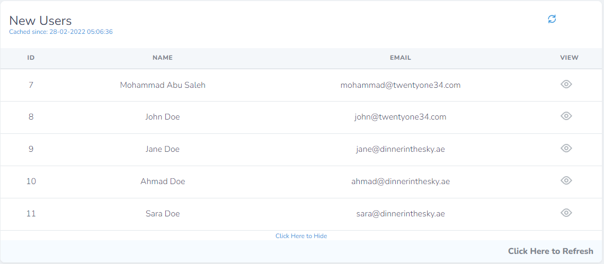

# Ajax Table Card

**Description**

A customisable Laravel Nova card that fetches data through ajax calls.

***

**Why?**

To allow displaying certain data on the dashboard or any other place of your choice, while fetching
the data through an AJAX call to reduce the initial page load time.

***

**Installation instruction**

``composer require twentyonetf/ajax-table-card``

***

**How?**

1. Create a class that extends ```AjaxTableCard```

```
<?php

namespace App\Nova\Cards;

use Twentyonetf\AjaxTableCard\AjaxTableCard;

class NewUsers extends AjaxTableCard
{
    /**
     * The width of the card (1/3, 1/2, or full).
     *
     * @var string
     */
    public $width = 'full';

    public string $title = 'New Users';

    public array $header = [
        'ID', 'Name', 'Email', 'View'
    ];

    public bool $expanded = true;

    public bool $link = '/api/new-users;
}

```

You could also use this artisan command:

```
php artisan card:create {CardClassName}
```

2. Register card like any nova card, for example:  ```NovaServiceProvider``` if you want it on the dashboard.

```
    /**
     * Get the cards that should be displayed on the Nova dashboard.
     *
     * @return array
     */
    protected function cards(): array
    {
        return [
            (new NewUsers())
        ];
    }
```

3. Generate and pass the data to the card.

```

Route::get('/api/new-users', function () {

    $users = User::today()->get();
    
    $data = $users->map(function ($user) {
        return [
            $session->id,
            $user->name,
            $user->email,
            "/admin/resources/users/{$user->id}"
        ];
    });

    return $data;
})

```

***

**Customisation**

| Option   | Type       | Description                                             | default         |
|----------|------------|---------------------------------------------------------|-----------------|
| $title   | ``string`` | Used to set the title of the card.                      | Ajax Table Card |
 | $header  | ``array``  | An array of the items in the header of the table.       | ``null``        |
 | $link    | ``string`` | The link to fetch the data from.                        | ``null``        |
 | $cache   | ``string`` | How long to cache the data for.                         | 86400           |
 | $linkable | ``bool``   | Is the last column of the table a link to a page?       | ``true``        |
 | $expanded | ``bool``   | The default status of table, expanded or collapsed      | ``true``        |
 | $countable | ``bool``   | Display a counter of how many results next to the title | ``true``        |
 | $hideWhenEmpty | ``bool``   | Hide the card when there's no data. | ``true``        |

***

**Screenshots**


